

  

> _Shortcuts_ app on macOSX environment
---

# shortcuts

## RATIONALE

* Custom shortcuts for the Shortcuts application developed by Apple and provided on its [iOS](https://apps.apple.com/us/app/shortcuts/id915249334), [iPadOS](https://apps.apple.com/us/app/shortcuts/id915249334), [macOS](https://support.apple.com/guide/shortcuts-mac/run-a-shortcut-from-the-app-apd5ba077760/8.0/mac/15.0), and [watchOS](https://apps.apple.com/us/app/shortcuts/id1462947752?platform=appleWatch) operating systems
* They are like macros that automate actions: go to our [digital repositories](https://ri.conicet.gov.ar/handle/11336/458/discover), [digital books](https://imhicihu.conicet.gov.ar/publicaciones/), [digital field notes](https://imhicihu.conicet.gov.ar/Bormida/), [PhD tesis](https://ri.conicet.gov.ar/handle/11336/458/discover?filtertype=type&filter_relational_operator=contains&filter=thesis), [digitized journals](https://imhicihu.conicet.gov.ar/colecciones-digitales/), etc. 
* Just one tap to access our digital content

https://github.com/user-attachments/assets/6774b2a7-fcd2-4a23-a7eb-bfbbb3d119bc

> _Shortcuts_ app on iPhone

### Download links from iCloud

Links

| Button | Logic |Link |
|:--|:--|:--|
|  | 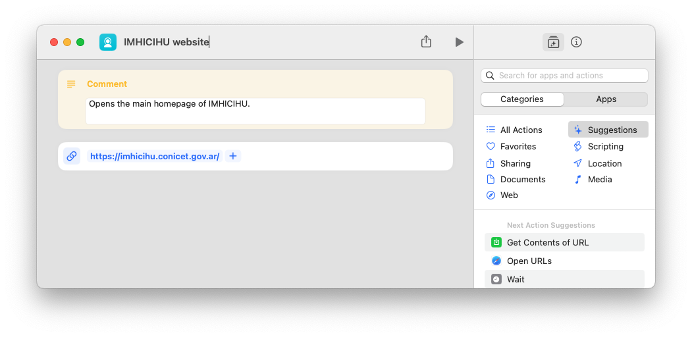| [Download](https://www.icloud.com/shortcuts/e31e760cfab049ea87b58156df88f8e0) |
|  | 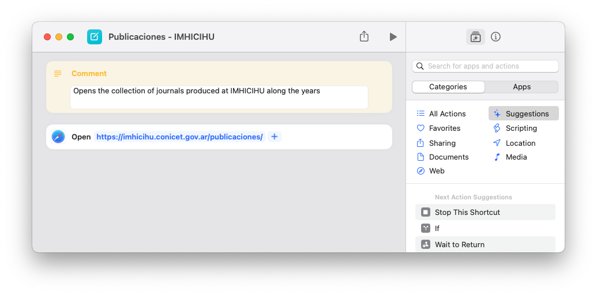| [Download](https://www.icloud.com/shortcuts/fd0d53d7288d41b1878f783d009f80df) |
|  | 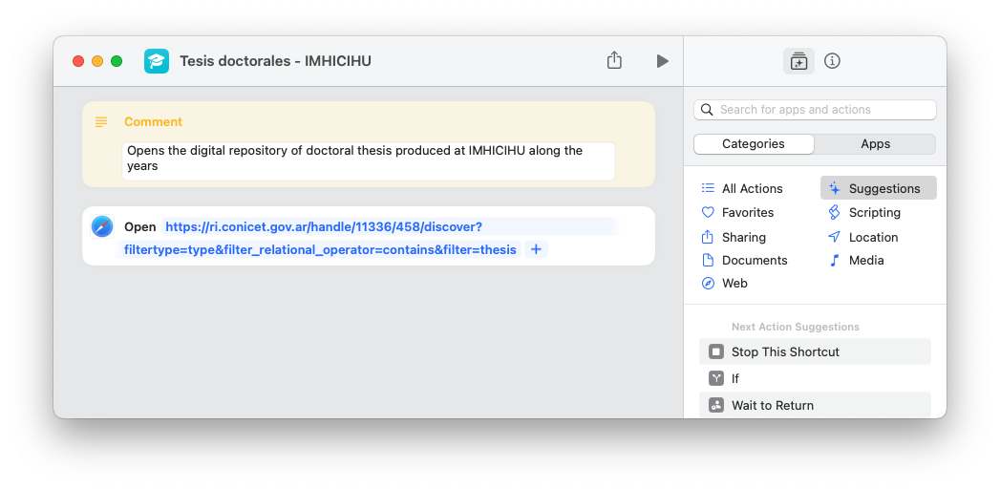| [Download](https://www.icloud.com/shortcuts/3ec40e0f47c64018aad99f820e2a686e) |
|  | 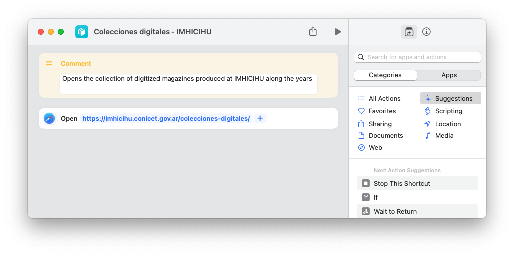| [Download](https://www.icloud.com/shortcuts/32bc5dfe4ffb4aa9aec13c631db83b1d) |
|  | | [Download](https://www.icloud.com/shortcuts/201f3ab2882a44f7a8e8830e6c793ac2) |
|  | 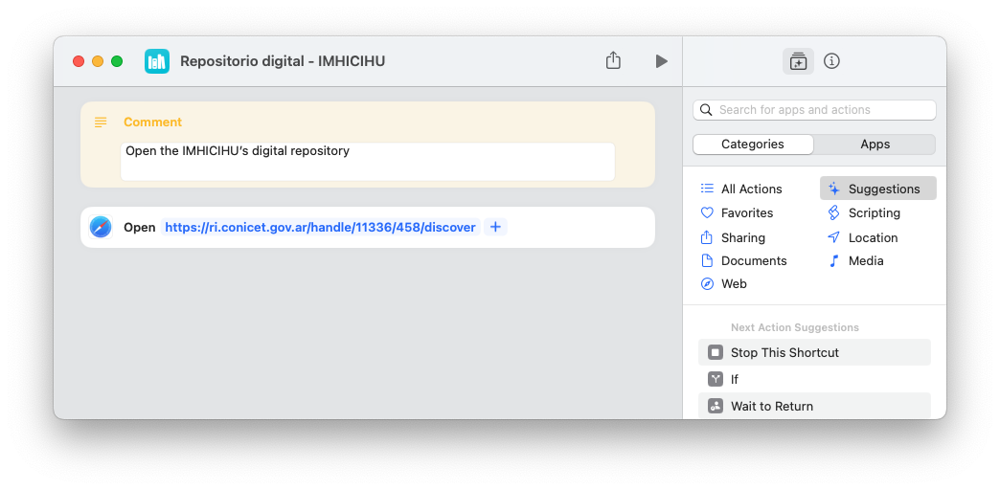| [Download](https://www.icloud.com/shortcuts/821656d2a40746a6bd576a96a35e00f2) |
|  | 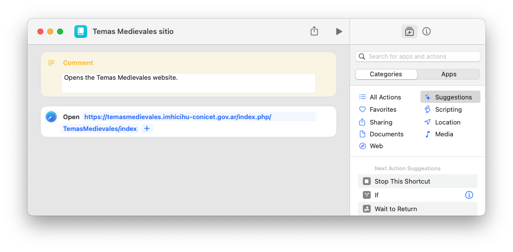| [Download](https://www.icloud.com/shortcuts/a8aa3c0d380a4180b159af81d6254b38) |
|  | 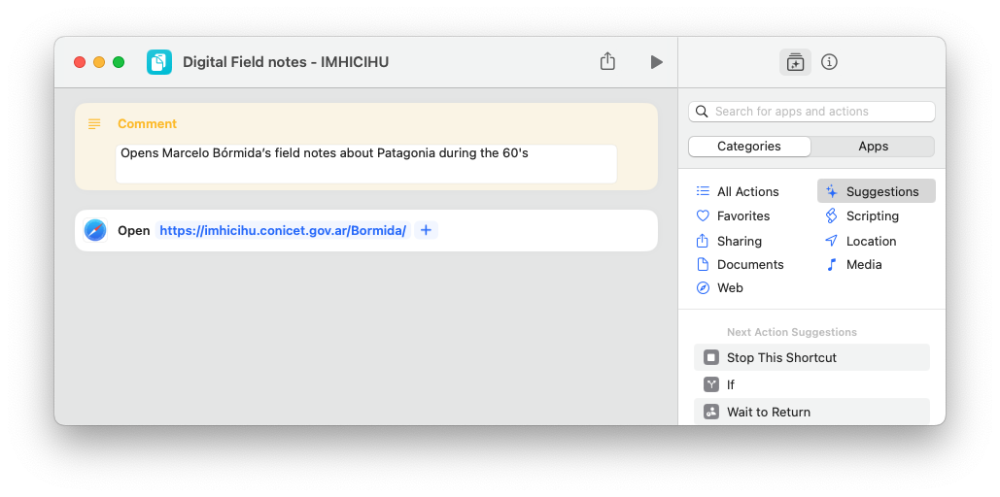| [Download](https://www.icloud.com/shortcuts/025b4bbe16f2400aa08d86c98076178f) |
|  | 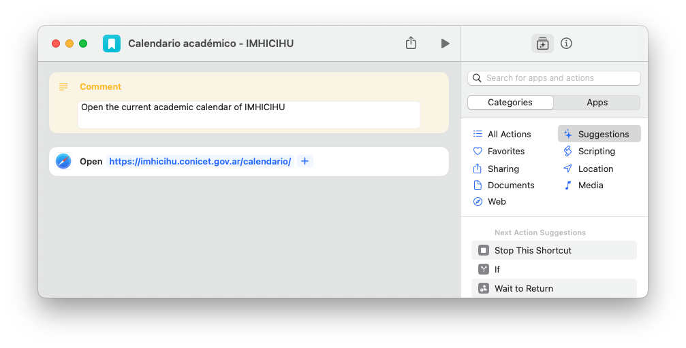| [Download](https://www.icloud.com/shortcuts/2789ed2169214ce6872314cc545a1303) |
|  | 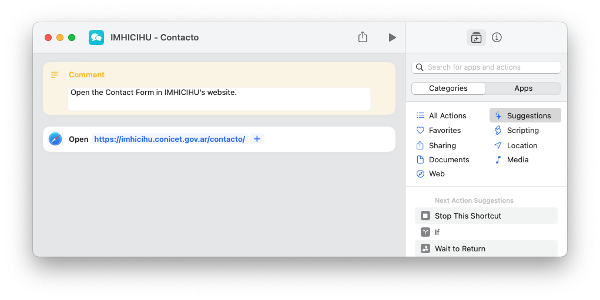| [Download](https://www.icloud.com/shortcuts/fb50a2e5722d414e82c39c5a7bea8acc) |
|  | 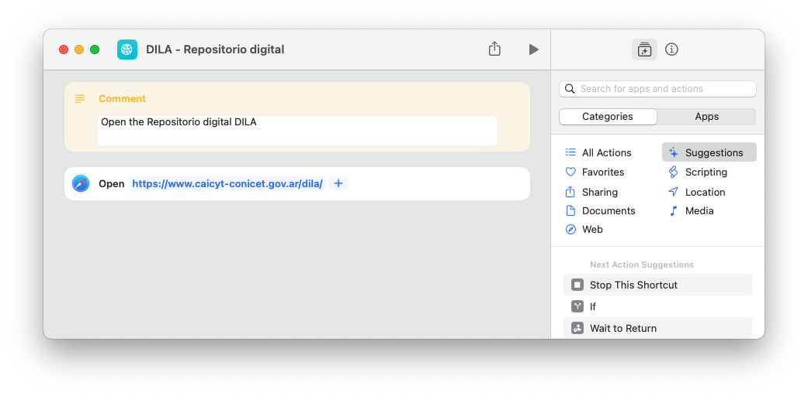| [Download](https://www.icloud.com/shortcuts/8fb7add9ea9a4b24ab3c7d9546bbe8f3) |
|  | 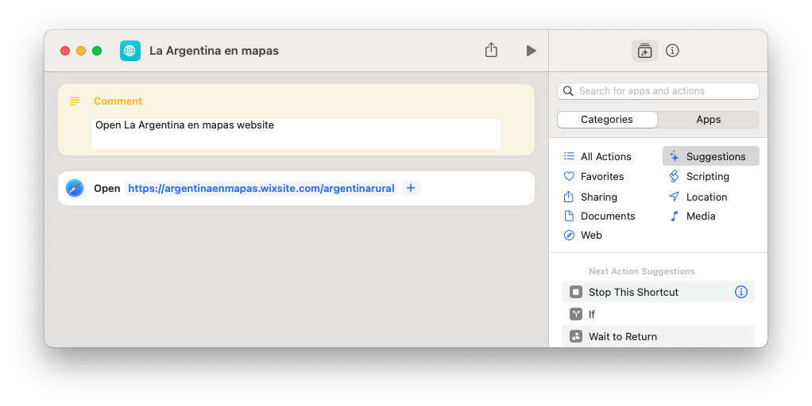| [Download](https://www.icloud.com/shortcuts/fc96b69a9caa44b2828d847c4d0c1d24) |
|  | 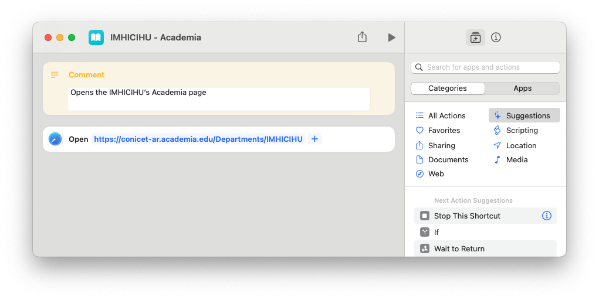| [Download](https://www.icloud.com/shortcuts/709df61f70c2411fa1ce46c0b64d8634) |
|  | 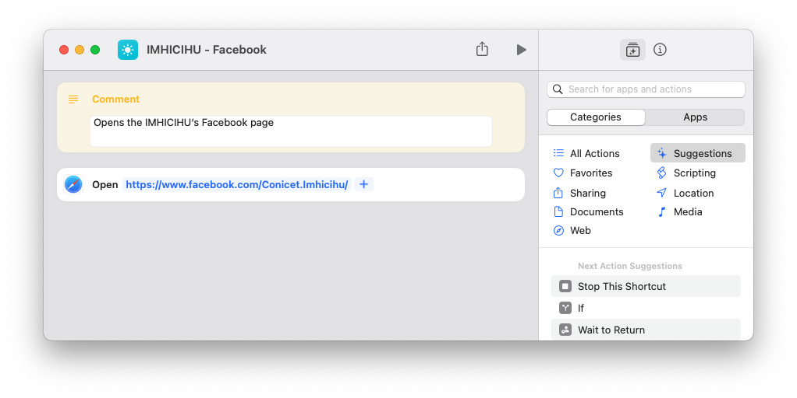| [Download](https://www.icloud.com/shortcuts/a1891dc1605b480e893d5d225e0140a9) |
|  | 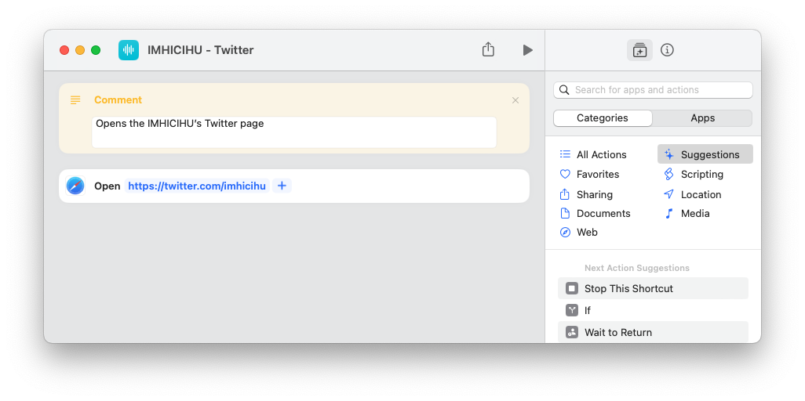| [Download](https://www.icloud.com/shortcuts/b18c26e74c79406a9d0b3611fd4bbbc0) |
|  | 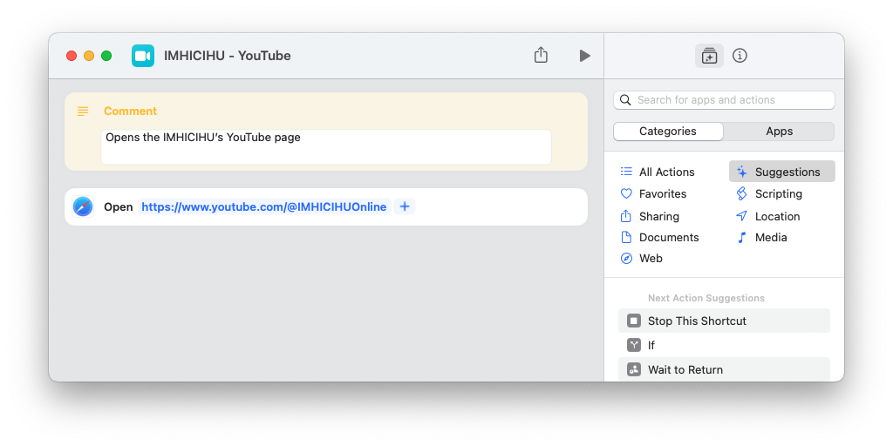| [Download](https://www.icloud.com/shortcuts/aab932521b624c1291e71e88d4e896b3) |
|  | 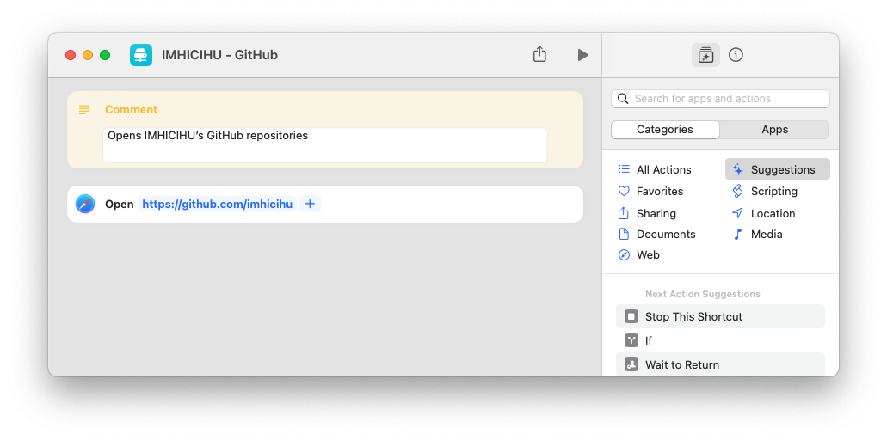| [Download](https://www.icloud.com/shortcuts/c25fcc0f62f64a099dba584fcad0d29e) |
|  | | [Download](https://www.icloud.com/shortcuts/4a20a41c31904101b073af17e68b0bdf) |

### Who do I talk to? ###

* Repo owner or admin
    - Contact `imhicihu` at `gmail` dot `com`

### Code of Conduct

* Please, check our [Code of Conduct](code_of_conduct.md)

### Legal ###

* All trademarks are the property of their respective owners

### License ###

* The content of this project itself is licensed under the 
